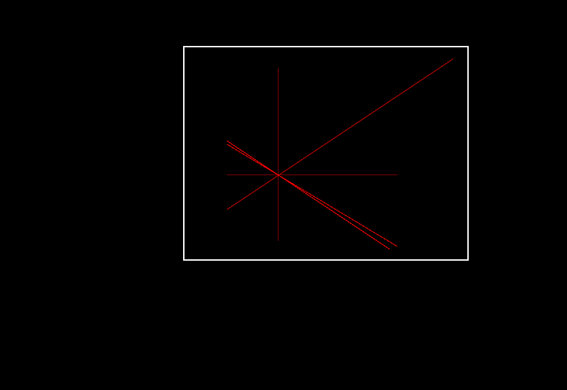
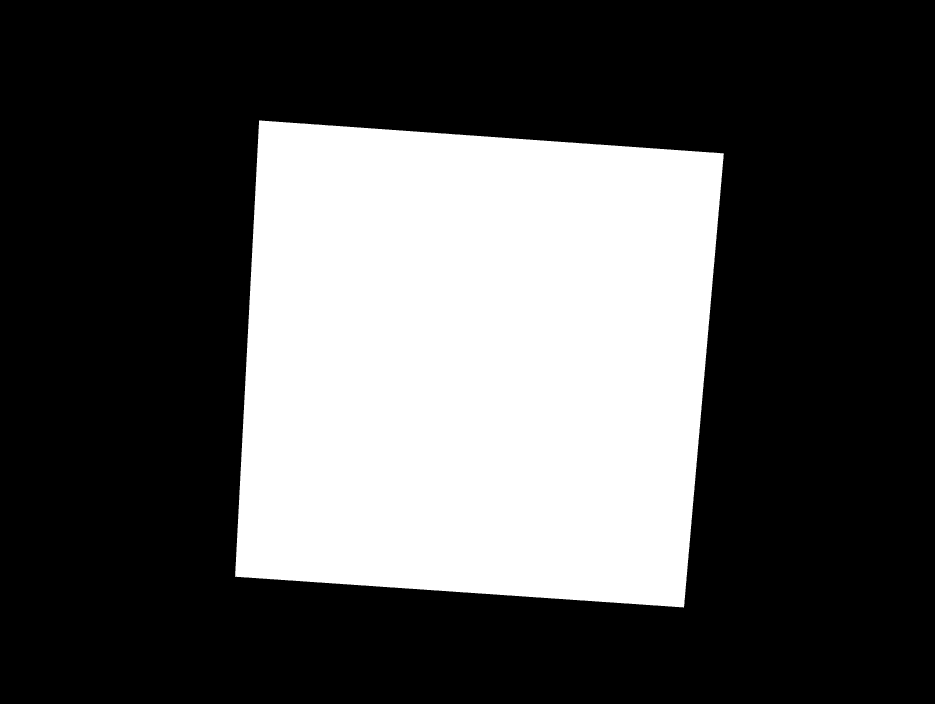
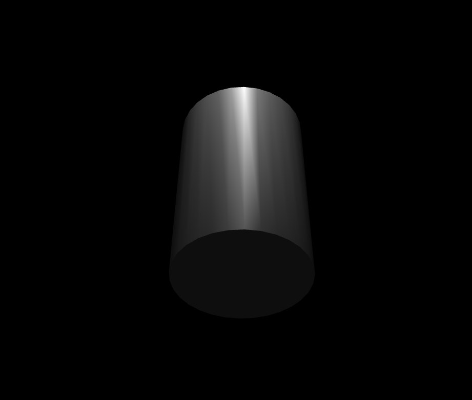
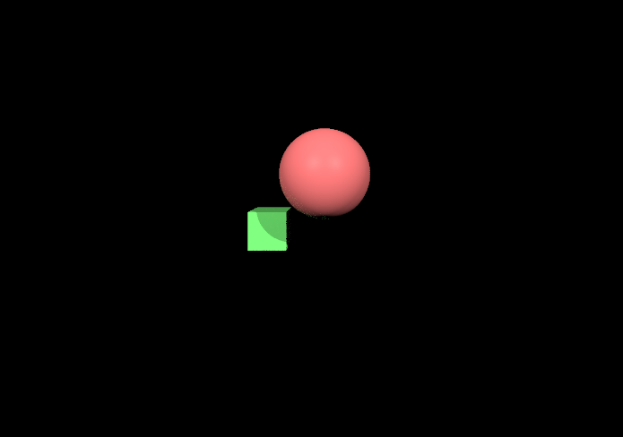

# Лабораторные работы по Компьютерной графике
## Кочкожаров Иван и Караев Тариель
### Лабораторная работа 1: Основы 2D-графики и трансформаций
**Вариант 10.** Реализация алгоритма отсечения линии (Cohen-Sutherland)

Реализуйте алгоритм отсечения линии с использованием алгоритма Коэна-Сазерленда.

Нарисуйте окно для отсечения и несколько линий, пересекающих это окно.

Реализуйте динамическое отсечение линий при изменении положения окна.

Дополнительно: Реализуйте возможность перемещения и масштабирования окна отсечения.

### Лабораторная работа 2: Основы 3D-графики и проекция
**Вариант 11.** Реализация теней для простого объекта

Постройте 3D-куб или пирамиду.

Используя перспективную проекцию, отобразите объект на экране.

Реализуйте примитивное затенение объекта с учетом его положения относительно "источника света" (без шейдеров).

### Лабораторная работа 3: Камера и базовые 3D-трансформации
**Вариант 3.** Камера: орбитальная камера с управлением мышью

Постройте 3D-сферу.

Реализуйте орбитальную камеру, которая вращается вокруг сферы, но управляется мышью (направление взгляда камеры изменяется перемещением мыши).

Добавьте возможность увеличения и уменьшения расстояния от камеры до сферы.

### Лабораторная работа 4: Освещение и работа с шейдерами
**Вариант 12.** Прожектор с реализацией физически корректного затухания света

Постройте цилиндр.

Реализуйте прожектор (Spotlight) с физически корректным затуханием света в зависимости от расстояния до объекта.

Используйте фрагментные шейдеры для расчета уровня освещения в зависимости от угла падения и расстояния до прожектора.

Дополнительно: Добавьте возможность изменения коэффициентов затухания для демонстрации различий в освещении.

### Лабораторная работа 5: Трассировка лучей (Ray Tracing)
**Вариант 5.** Реалистичное глобальное освещение
Постройте сцену с кубом и сферой.

Реализуйте глобальное освещение (Global Illumination) с помощью трассировки лучей.

Обеспечьте взаимодействие объектов со светом, отскакивающим от других поверхностей (интерфлексии света).

